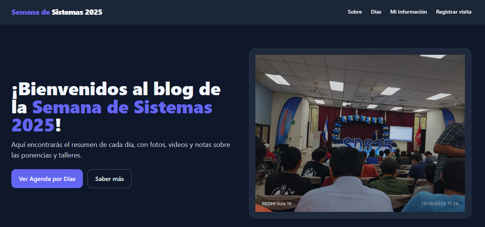

# Blog de la Semana de Sistemas 2025



## 📖 Descripción

Este sitio web documenta las actividades realizadas durante la **Semana de Sistemas 2025**, incluyendo fotografías, videos y descripciones de los talleres, ponencias y eventos realizados.
Fue desarrollado como parte de la materia **Tecnicas de Programacion para Internet**, y busca demostrar el uso de **tecnologías, herramientas y conceptos aprendidos**.

---

## ⚙️ Tecnologías Utilizadas

- **HTML5**, **CSS3**, **Tailwind CSS**
- **JavaScript** (Frontend)
- **PHP** con patrón MVC (Backend)
- **MySQL / JSON** como almacenamiento de datos
- **Docker**, **Nginx** o **Apache** para despliegue local
- **Git & GitHub** para control de versiones

---

## 🚀 Cómo Ejecutarlo Localmente

1. Clona este repositorio:
   ```bash
   git clone https://github.com/luxoritur/Semana-Sistemas-2025.git

2. Crear contenedores:
   ```bash
   docker compose up --build   

2. Una vez iniciados los contenedores la pagina estara disponible en:
   ```bash
   http://localhost:8081/public/ 


### 💻 Creado por: David Elias Romero Claros - RC23030